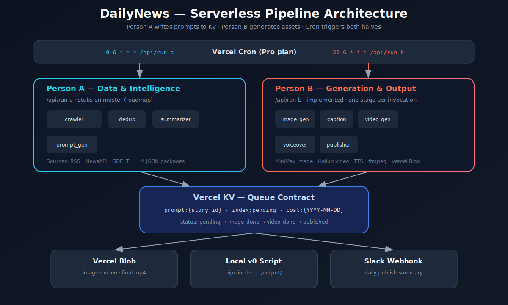

<div align="center">


# DailyNews

### Turn today's top headlines into captioned meme videos automatically, every morning.


**News crawl | live topic search | LLM meme scoring | MiniMax image and Hailuo video | TTS voiceover | Vercel Blob publish**

</div>

---

## Table of Contents

- [Overview](#overview)
- [Why It Exists](#why-it-exists)
- [Demo and Assets](#demo-and-assets)
- [Architecture](#architecture)
- [Status at a Glance](#status-at-a-glance)
- [Quick Start](#quick-start)
- [Configuration](#configuration)
- [Repository Map](#repository-map)
- [How It Works](#how-it-works)
- [API Surface](#api-surface)
- [Operational Notes](#operational-notes)
- [Verification](#verification)
- [Roadmap](#roadmap)
- [Documentation](#documentation)
- [Privacy and Safety](#privacy-and-safety)
- [License](#license)

---

## Overview

DailyNews, also called Meme Video Agent in the design docs, is a daily pipeline that converts real news into short meme videos. It can run as a local end-to-end generator today, and it is structured for a Vercel serverless deployment with cron-triggered API routes, Vercel KV, Vercel Blob, and resumable generation stages.

The system is designed for two parallel workstreams:

- **Person A** owns data ingestion and prompt creation (`data/`, `/api/run-a`).
- **Person B** owns media generation and publishing (`generation/`, `/api/run-b`).

The contract between those halves is a Vercel KV record at `prompt:{story_id}`. Person A writes prompt fields and sets `status: pending`. Person B advances status through `image_done -> video_done -> published` and writes asset URLs.

There are three ways to use the project today:

1. **Local v0 pipeline** - `npm start` runs `pipeline.ts` end-to-end into `./output/`.
2. **Control-room UI** - `npm run dev` starts the local API and Vite web app for searching a topic, scraping five live headlines, and triggering a mega-meme run.
3. **Serverless target** - Vercel Cron triggers `/api/run-a` and `/api/run-b` against KV and Blob once production services are provisioned.

Product requirements live in [`spec.md`](./spec.md). Full technical design lives in [`DESIGN.md`](./DESIGN.md).

## Why It Exists

Short-form meme news is still built by hand: pick a story, find an angle, write captions, generate visuals, animate, narrate, export, and upload. DailyNews turns that workflow into a repeatable pipeline so one prompt or scheduled run can produce a finished, narrated MP4.

The core product bets are:

- **Timeliness** - pull live headlines from RSS, NewsAPI, and GDELT-style sources.
- **Creative synthesis** - fuse related headlines into one joke instead of summarizing a single article.
- **Operator control** - expose a web UI for searching, previewing headlines, triggering generation, and watching status.
- **Production shape** - use queues, budget guards, resumable stages, structured logs, and Blob-backed outputs instead of a one-off script.

## Demo and Assets

Use these checked-in assets for submissions, demos, and README previews:

| Asset | Path | Purpose |
|---|---|---|
| Project banner | [`docs/assets/banner.png`](docs/assets/banner.png) | README hero and hackathon thumbnail |
| Architecture diagram | [`docs/assets/architecture.svg`](docs/assets/architecture.svg) | Technical overview |
| Local generated media | `output/<story_id>/final.mp4` | Local pipeline output when generated |
| Captioned frame | `output/<story_id>/captioned.png` | Static preview frame when generated |

Local generated outputs are useful for demo evidence, but they depend on the current `.env` keys and generated story IDs.

## Architecture



```text
Vercel Cron
  |-- 06:00  POST /api/run-a   Person A: crawl -> dedup -> summarize -> enqueue (KV)
  `-- 06:30  POST /api/run-b   Person B: one stage per story -> Blob + Slack

KV queue: prompt:{story_id} | index:pending | cost:{date}
Blob assets: image | video | final.mp4
```

Person B processes one stage per invocation so long-running Hailuo polling and ffmpeg merges stay inside Vercel's function window. Re-running `/api/run-b` resumes from the current `status` and stored `video_task_id`.

The current branch also includes a local web workflow:

```text
React/Vite UI (:5173)
  |-- /api/status        current queue/output state
  |-- /api/stories       generated stories from KV or local output
  |-- /api/search-news   live topic search
  `-- /api/generate-meme scrape 5 headlines -> synthesize -> generate media

Local API (:3000)
  `-- scripts/dev-api.ts mirrors the API routes without requiring Vercel login
```

## Status at a Glance

| Area | State |
|------|-------|
| Person B: image, caption, video, voiceover, publisher | Implemented |
| Person B: `/api/run-b` fire-and-forget cron route | Implemented |
| Shared: KV queue helpers + daily budget guard | Implemented |
| Topic search: five related live headlines | Implemented |
| Mega-meme synthesis from five headlines | Implemented |
| Local API server for Vite development | Implemented |
| React control-room UI | Implemented |
| Local `pipeline.ts` v0 (NewsAPI + LLM + MiniMax) | Implemented |
| Person A scheduled crawl modules and `/api/run-a` | In progress / partially implemented |
| Production E2E on Vercel KV + Blob | Not yet validated |

This table is intentionally conservative: implemented means code is present in this repo; production E2E remains separate until the Vercel services and provider keys are validated together.

## Quick Start

### Prerequisites

- Node.js 20+
- npm
- API keys in `.env` (see [Configuration](#configuration))

### Install

```powershell
cd dailynews
npm install
npm install --prefix web
Copy-Item .env.example .env
```

Fill the required keys in `.env` before running generation:

```powershell
# Minimum useful local generation keys
NEWS_API_KEY=
LLM_API_KEY=
LLM_BASE_URL=
LLM_MODEL=
MINIMAX_API_KEY=
```

### Local v0 pipeline

```powershell
npm start
```

Outputs land in `./output/<story_id>/final.mp4`.

### Control-room UI

```powershell
npm run dev
```

The root script starts both services:

- API: `http://127.0.0.1:3000`
- UI: `http://127.0.0.1:5173`

From the UI, search a topic, review five live headlines, then trigger a generated mega-meme. The UI reads generated stories from Vercel KV when available and falls back to local output.

### Serverless development

```powershell
npm install
vercel login
vercel link
vercel env pull .env.local
npm run dev:api:vercel
```

Trigger routes manually:

```powershell
# Person A
curl -Method POST http://localhost:3000/api/run-a

# Person B
curl -Method POST http://localhost:3000/api/run-b
```

### Deploy to Vercel

```powershell
vercel --prod
```

Cron jobs require the Vercel Pro plan. Enable KV and Blob in the project dashboard, then add secrets from [`.env.example`](./.env.example).

## Configuration

Copy [`.env.example`](./.env.example) to `.env` or `.env.local`.

| Variable | Required for | Description |
|----------|--------------|-------------|
| `NEWS_API_KEY` | Local v0 / Person A | NewsAPI top headlines |
| `LLM_API_KEY` | Local v0 / Person A / mega-meme synthesis | OpenAI-compatible LLM key |
| `LLM_BASE_URL` | Local v0 / mega-meme synthesis | OpenAI-compatible API base |
| `LLM_MODEL` | Local v0 / mega-meme synthesis | Model slug for prompt JSON |
| `TOP_N_STORIES` | Person A tuning | Number of stories to summarize/enqueue per run |
| `MIN_MEME_SCORE` | Person A tuning | Drop stories below this score |
| `MINIMAX_API_KEY` | Person B / local generation | Image, Hailuo video, and TTS |
| `MINIMAX_GROUP_ID` | Person B | Optional account scoping |
| `MINIMAX_IMAGE_MODEL` | Person B | Optional MiniMax image model override |
| `MINIMAX_VIDEO_MODEL` | Person B | Optional MiniMax video model override |
| `MINIMAX_TTS_MODEL` | Person B | Optional MiniMax TTS model override |
| `MINIMAX_VOICE_ID` | Person B | Optional TTS voice override |
| `BLOB_READ_WRITE_TOKEN` | Person B serverless | Vercel Blob uploads |
| `KV_REST_API_URL` | Shared serverless | Vercel KV / Upstash Redis |
| `KV_REST_API_TOKEN` | Shared serverless | KV auth token |
| `KV_URL` | Shared serverless | Vercel KV connection URL |
| `SLACK_WEBHOOK_URL` | Person B | Optional daily summary |
| `DAILY_VIDEO_BUDGET_USD` | Shared | Hard spend cap, default `5` |
| `API_PORT` | Local dev API | Optional local API port, default `3000` |

Secrets should stay server-side. The web app calls local or deployed API routes and does not need provider keys in the browser.

## Repository Map

```text
dailynews/
|-- api/
|   |-- run-a.ts            # Person A cron entry
|   |-- run-b.ts            # Person B cron entry
|   |-- search-news.ts      # Topic search API
|   |-- generate-meme.ts    # Async mega-meme API
|   |-- status.ts           # Queue/output status API
|   |-- stories.ts          # Generated stories API
|   `-- local-asset.ts      # Local generated asset serving
|-- data/
|   |-- crawler.ts          # RSS, NewsAPI, GDELT-style crawling
|   |-- search_news.ts      # Query-based five-headline search
|   |-- dedup.ts            # Dedup/relevance scoring
|   |-- pick_related.ts     # Related-story selection
|   |-- summarizer.ts       # LLM story summarization
|   |-- meme_synthesizer.ts # Fuse five headlines into one meme concept
|   `-- prompt_gen.ts       # Prompt package creation / enqueue
|-- generation/
|   |-- image_gen.ts        # MiniMax image generation
|   |-- caption.ts          # sharp meme captions
|   |-- video_gen.ts        # MiniMax Hailuo image-to-video
|   |-- voiceover.ts        # MiniMax TTS + ffmpeg merge
|   |-- publisher.ts        # Vercel Blob + Slack
|   |-- pipeline.ts         # Queue orchestration
|   `-- generate_meme.ts    # Search/crawl -> synthesize -> generate
|-- shared/
|   |-- types.ts            # PromptPackage contract
|   |-- queue.ts            # KV and local-memory queue helpers
|   |-- memory_queue.ts     # Local fallback queue
|   |-- local_output.ts     # Local output indexing
|   |-- cost_tracker.ts     # Budget guard
|   |-- minimax.ts          # MiniMax API client
|   `-- minimax_models.ts   # MiniMax model defaults
|-- scripts/
|   `-- dev-api.ts          # Local API server for Vite workflow
|-- web/
|   |-- src/App.tsx         # Control-room UI
|   |-- src/lib/api.ts      # API client
|   |-- src/components/     # UI and story cards
|   `-- package.json        # React/Vite/Tailwind app
|-- pipeline.ts             # Local v0 single-file runner
|-- docs/assets/
|   |-- banner.png          # README hero
|   `-- architecture.svg
|-- spec.md                 # Product spec
|-- DESIGN.md               # Technical design
|-- vercel.json             # Cron + function limits
`-- .env.example
```

## How It Works

### Person A: data and intelligence

1. Crawl Google News RSS, Reuters-style RSS, NewsAPI, and GDELT-style sources.
2. Deduplicate and score stories.
3. Summarize or synthesize stories into strict JSON: tone, meme score, prompts, captions, and voiceover.
4. Write `prompt:{story_id}` to KV or local fallback storage with `status: pending`.

### Person B: generation and output

1. `pending -> image_done`: generate a MiniMax image, add caption overlay, and upload or store the image.
2. `image_done -> video_done`: animate with Hailuo image-to-video and persist `video_task_id` for resume.
3. `video_done -> published`: add MiniMax TTS voiceover, merge with ffmpeg, publish final MP4, and optionally post a Slack summary.

Each paid call checks `DAILY_VIDEO_BUDGET_USD` before running. Structured JSON logs go to stdout for `vercel logs` or the local API console.

### Control-room flow

1. Search any topic from the UI.
2. `/api/search-news` returns five deduped, relevance-ranked live headlines.
3. `/api/generate-meme` accepts the topic plus the previewed headline set, starts work asynchronously, and returns `202`.
4. The UI polls `/api/status` and `/api/stories` until the final asset is published or stored locally.

## API Surface

| Route | Method | Purpose |
|---|---|---|
| `/api/run-a` | `GET` / `POST` | Crawl, score, and enqueue prompt packages |
| `/api/run-b` | `GET` / `POST` | Drain pending work and advance generation stages |
| `/api/search-news?q=<topic>` | `GET` | Search live news and return five related headlines |
| `/api/generate-meme` | `POST` | Start search/synthesis/generation for a topic |
| `/api/status` | `GET` | Return queue, spend, and output status |
| `/api/stories` | `GET` | Return generated stories from KV or local output |
| `/api/local-asset` | `GET` | Serve local generated assets during development |

Example mega-meme request:

```powershell
curl -Method POST http://127.0.0.1:3000/api/generate-meme `
  -ContentType "application/json" `
  -Body '{"query":"AI regulation"}'
```

## Operational Notes

- **Cron plan requirement:** Vercel Cron requires the Pro plan.
- **Gateway timeout:** Cron-triggered HTTP requests may be cut at the gateway before a 300s function finishes, so routes return quickly and continue work in the background where supported.
- **Idempotency:** generation resumes from the current story status instead of duplicating work.
- **Local fallback:** when KV is unavailable, the dev flow can read from local output and local memory helpers.
- **Budget guard:** paid provider calls are checked against `DAILY_VIDEO_BUDGET_USD`.
- **Observability:** structured logs include stage, story ID, timing, cost, and status.

## Verification

```powershell
npm run typecheck
npm run build:web
```

Typecheck is the current root CI gate. The web build validates the React/Vite control-room surface. End-to-end serverless validation requires provisioned KV, Blob, MiniMax, LLM, and news credentials.

## Roadmap

- [ ] Complete and harden Person A scheduled crawl behavior in `/api/run-a`
- [ ] First production cron run with real KV queue and Blob publishing
- [ ] Tune meme-score thresholds and max videos per day
- [ ] Add richer dashboard observability for failed or paused stories
- [ ] Optional auto-post to TikTok, YouTube Shorts, or X

## Documentation

| Doc | Purpose |
|-----|---------|
| [`spec.md`](./spec.md) | Product spec and status |
| [`DESIGN.md`](./DESIGN.md) | Architecture, module specs, queue schema |
| [`CLAUDE.md`](./CLAUDE.md) | Agent session context |

## Privacy and Safety

- Provider keys stay in `.env`, `.env.local`, Vercel environment variables, or server-only runtime contexts.
- Generated media can be based on live news and should be reviewed before public posting.
- The current project publishes to local output or Vercel Blob; social auto-posting is roadmap work, not active behavior.
- No license file is currently checked in, so reuse rights are not yet declared.

## License

No license file is currently checked in to this repository.
